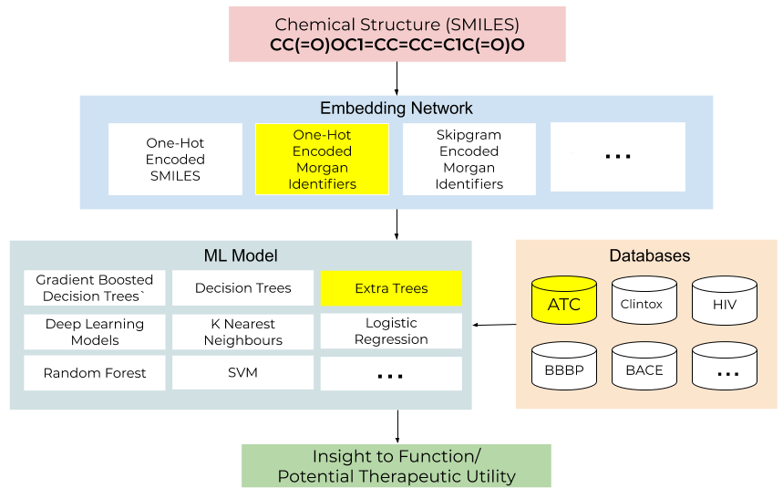

## How to use

##### Usage
- -e (--embedding) values: smile, morgan, skipgram
- -d (--dimensions) values: 50,100,150,200,250,300 (applicable only to skipgram)
- -c (--classifier) values: lr, svm, gb, sgd, xgb, dt, rf, xt, knn

```
cd lib
python main.pyc -e smile -c rf -t 3
python main.pyc -e morgan -c xgb -t 4
python main.pyc -e skipgram -d 100 -c xt -t 14
>>> smiles : (enter smile, example: CC(=O)OC1=CC=CC=C1C(=O)O)
```

